# Exploratory Data Analysis

## AGE 

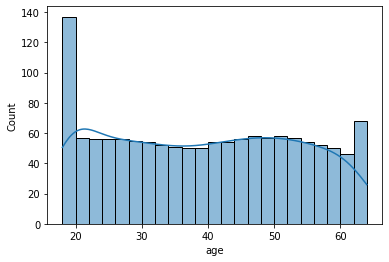

### From the above figure, we can see that, in most of the age bin ranges, the distribution of population in age bins is almost uniform except in first and last bin.
_____________
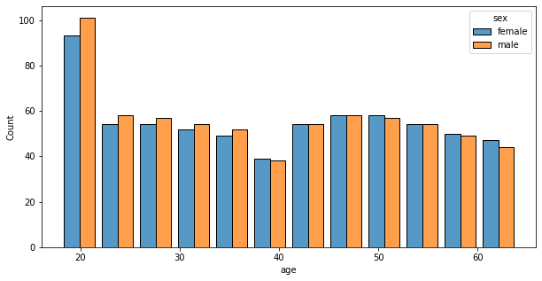

### From the above figure, we can see that, in each bin, male and female are almost equal.
_________

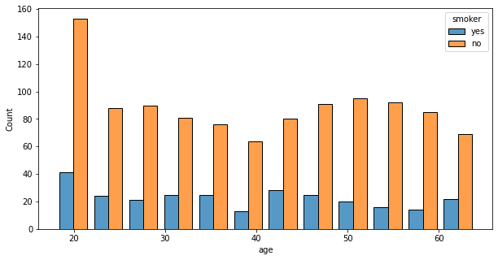

### From the above figure, we can see that, in each bin,the population of smokers is around 1/3rd of non-smokers.

________

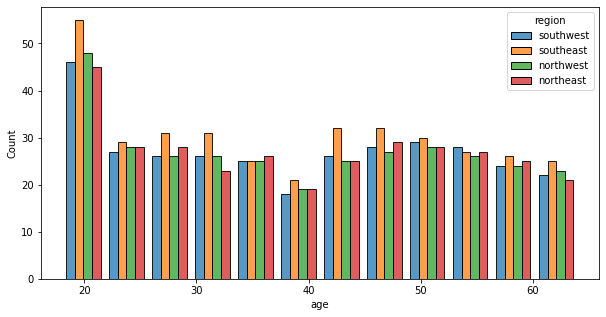

### From the above figure, we can see that, in each bin, there are almost equal population from every region.
________

## BMI

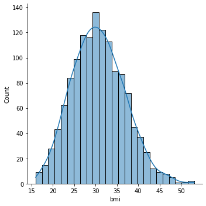

________

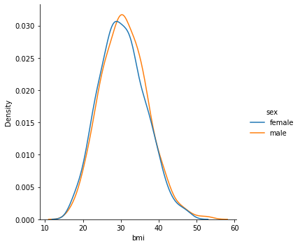

### From the above  figure we can see that the BMI for male and female are simuliar.
________

## Regions

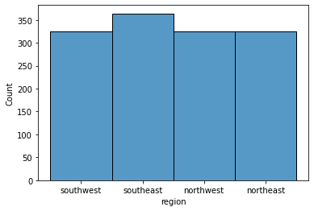

________

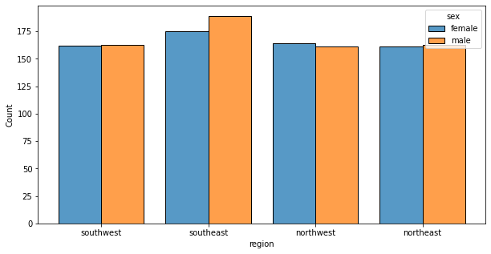

### * From the above figure, we can see that, from each region the male and female population is almost equal.
________

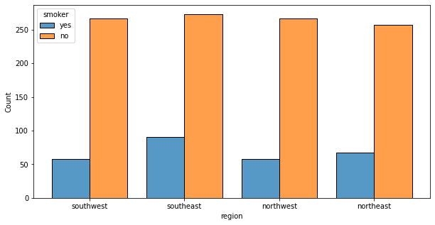

### * From the above figure, we can see that, in each region, the ratio of smoker to non-smoker is almost equal.
________

## Charges

________

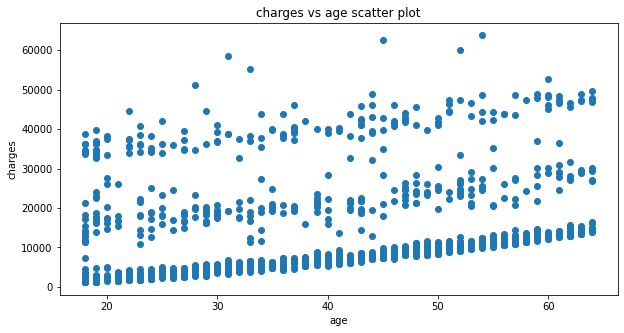

### We can see an upward trend in charges. This is obvious as the age increses the chance of getting illness increases and medical charges increses.
________

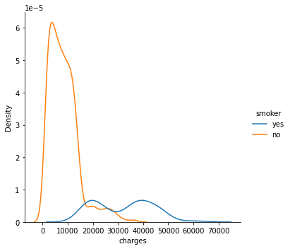

### The somkers pay higher charges compared to non-smokers

____________

con